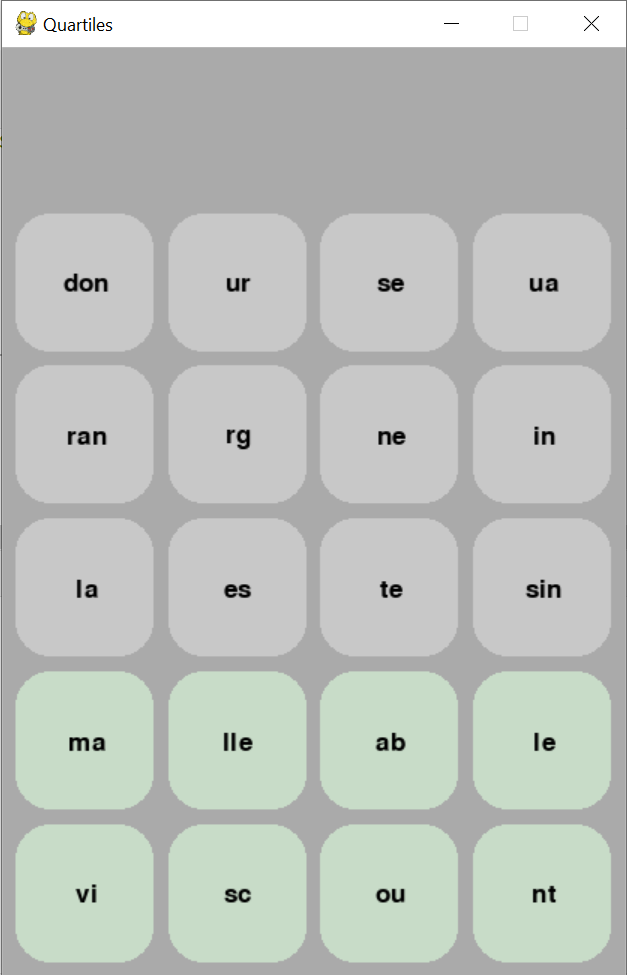
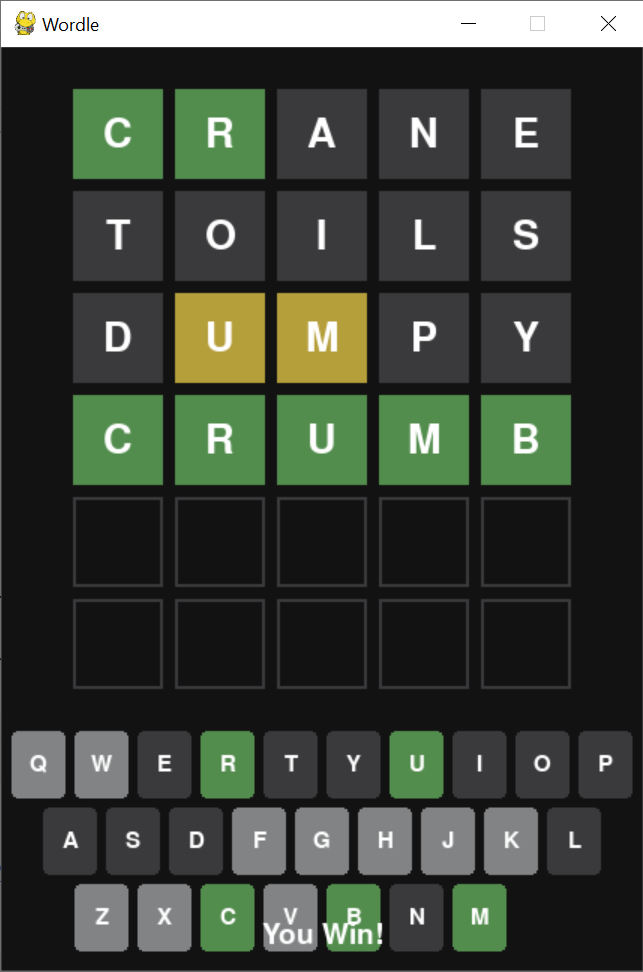
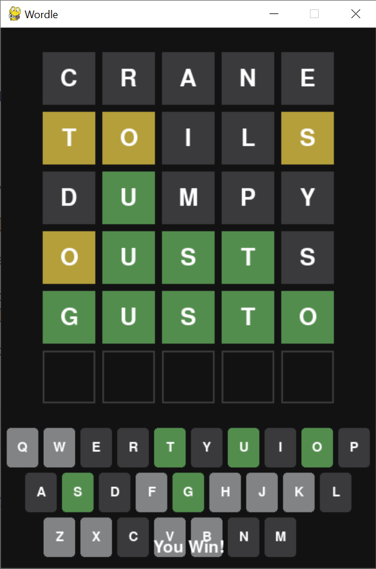

Play fun and engaging games to test your vocabulary and thinking

In Quartiles, make groups of 4 syllables to form words. Match every component to a group to win.

Wordle is a variation of Mastermind. Guess a five letter word until you uncover the secret word. Green means that position is correct,
yellow means the letter is in the word, but in a different spot, and grey means the letter does not appear at all in the word.

